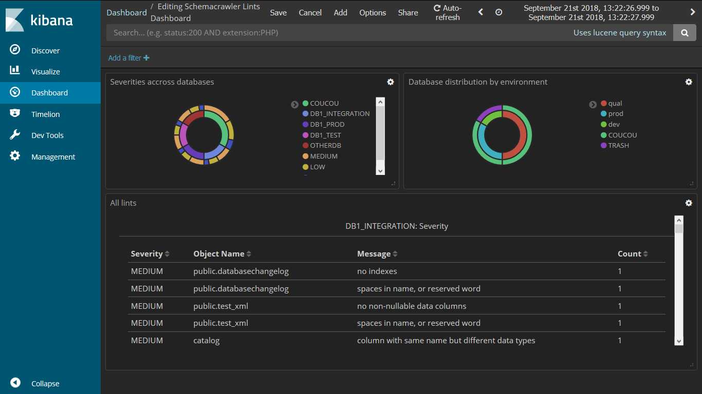

# schemacrawler-additional-command-lints-as-csv
An additional command for schemacrawler to dump lints as csv files.

See [linkedIn article](https://www.linkedin.com/pulse/continuous-database-linting-dashboards-bring-analytics-adrien-sales/) for more details.

