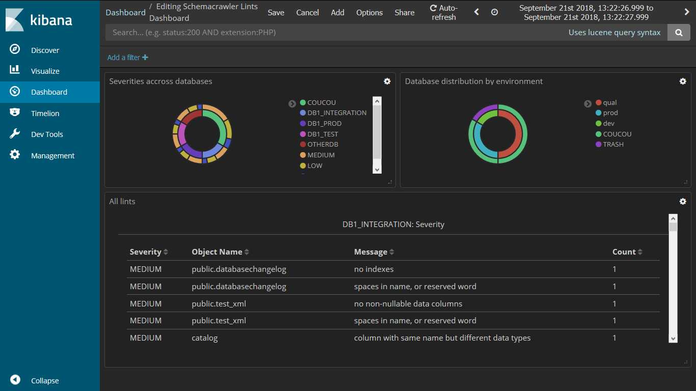

[](https://travis-ci.org/adriens/schemacrawler-additional-command-lints-as-csv)
[](https://jitpack.io/#adriens/schemacrawler-additional-command-lints-as-csv)

# schemacrawler-additional-command-lints-as-csv

An additional [command](http://www.schemacrawler.com/plugins.html) for
[schemacrawler](http://www.schemacrawler.com/) to dump lints as csv files,
with some additional fields.

See [linkedIn article](https://www.linkedin.com/pulse/continuous-database-linting-dashboards-bring-analytics-adrien-sales/) for more details or check the [Pinterest album for more samples](https://www.pinterest.com/rastadidi/schemacrawler-lint-dashboards/)

# Install steps

Build the jar :

```
mvn clean package
```

then copy the jar to `$SCHEMACRAWLER_HOME/lib` and you're done with install steps.

This `jar` adds the following command with the following options :

```
-c=csv -dbid=666 -dbenv=hell
```

- `-c=csv` : tells that we want to dump the lints as a csv file
- `-dbis`  : optional paramater if you want to stick on a given database
- `-dbenv` : optional paramater if you want to tag a database to an environment (typically prod, dev, test, ...)

You then get a csv file called : `schemacrawler-lints-<UUID>.csv` in your working dir.

# Contribute

You can contribute code, but also your own dashoard realizations. Therefore, just make a PR that :

- add an image to the `img` directory
- add the screenshot to the dedicated `SCREENSHOTS.md` file or a link to a video : any cool demo is welcome  

See [linkedIn article](https://www.linkedin.com/pulse/continuous-database-linting-dashboards-bring-analytics-adrien-sales/) for more details.


